# AI-Driven Development Course - System Design Document

## 📋 Document Overview

This design document provides a comprehensive analysis of the AI-Driven Development Course system, including the sample web application architecture, persona workflows, and AI-enhanced development processes.

**Document Version:** 1.0  
**Last Updated:** September 30, 2025  
**Authors:** System Analysis Team  

## 🎯 System Purpose & Scope

### Purpose

The system serves as a comprehensive learning platform for development teams to master AI-driven development workflows spanning Business Analysis, Development, QA, DevOps, and Documentation. The sample web application provides a practical, real-world context for learning modern web development practices.

### Key Objectives

- Enable cross-functional teams to leverage AI tools effectively
- Demonstrate end-to-end development processes with AI assistance
- Provide hands-on experience with modern web application architecture
- Foster collaboration between different development personas
- Showcase modern web development patterns and best practices

---

## 🏗️ System Architecture Overview

```mermaid
graph TB
    subgraph "Learning Platform"
        CP[Course Platform]
        PE[Persona Exercises]
        TM[Templates & Guides]
        COL[Collaboration Workflows]
    end
    
    subgraph "Sample Application - WebApp"
        FE[React Frontend]
        AG[API Gateway]
        MS[Microservices]
        DB[(Database Layer)]
        EXT[External Services]
    end
    
    subgraph "AI Tools Integration"
        GC[GitHub Copilot]
        CA[Cursor AI]
        VS[VS Code Extensions]
        AI[AI Assistants]
    end
    
    subgraph "Development Infrastructure"
        GH[GitHub Repository]
        CI[CI/CD Pipelines]
        DOC[Docker Containers]
        MON[Monitoring & Observability]
    end
    
    CP --> PE
    PE --> TM
    PE --> COL
    
    COL --> FE
    FE --> AG
    AG --> MS
    MS --> DB
    MS --> EXT
    
    PE --> GC
    PE --> CA
    PE --> VS
    PE --> AI
    
    COL --> GH
    GH --> CI
    CI --> DOC
    DOC --> MON
    
    class CP,PE,TM,COL fill:#e1f5fe
    class FE,AG,MS,DB,EXT fill:#f3e5f5
    class GC,CA,VS,AI fill:#e8f5e8
    class GH,CI,DOC,MON fill:#fff3e0
```

---

## 👥 Persona-Based Architecture

### Persona Interaction Flow

---

## 🌐 Sample Web Application Architecture

### High-Level System Architecture

### Database Schema Design

---

## 🔄 AI-Enhanced Development Workflows

### AI-Driven Development Lifecycle

---

## 🚀 CI/CD Pipeline Architecture

### Complete CI/CD Flow

---

## 📊 Monitoring & Observability

### Monitoring Architecture

---

## 🎓 Learning Path & Exercise Flow

### Course Progression Map

---

## 📋 Technical Specifications

### Technology Stack Summary

| Layer | Technology | Purpose | AI Enhancement |
|-------|------------|---------|----------------|
| **Frontend** | React 18 + TypeScript | User Interface | AI-generated components |
| **API Gateway** | Express.js + Node.js | Request routing | AI-optimized routing |
| **Microservices** | Node.js + TypeScript | Business logic | AI-generated services |
| **Database** | MongoDB | Document storage | AI query optimization |
| **Cache** | Redis 6 | Performance optimization | AI caching strategies |
| **Search** | Elasticsearch | Data search & analytics | AI-powered search |
| **Message Queue** | RabbitMQ | Async processing | AI message prioritization |
| **Containerization** | Docker + Kubernetes | Deployment | AI resource optimization |
| **Monitoring** | Prometheus + Grafana | Observability | AI anomaly detection |
| **CI/CD** | GitHub Actions | Automation | AI deployment strategies |

---

## 🏆 Success Metrics & Assessment

### Learning Assessment Framework

---

## 📚 Conclusion

This design document provides a comprehensive blueprint for the AI-Driven Development Course system. The architecture emphasizes:

### Key Strengths

- **Persona-driven approach** enabling role-specific AI enhancement
- **Real-world web application** providing practical learning context
- **Comprehensive CI/CD integration** with AI-powered automation
- **Modern development practices** with industry-standard tools
- **Scalable microservices architecture** supporting growth
- **AI-first design principles** across all development phases

### Success Factors

1. **AI Integration**: Deep integration of AI tools across all development phases
2. **Collaboration**: Strong cross-persona collaboration workflows
3. **Practical Learning**: Hands-on experience with real web application scenarios
4. **Quality Focus**: Comprehensive testing and quality assurance
5. **Modern Stack**: Current technology stack and best practices
6. **Scalability**: Architecture designed for growth and evolution

### Next Steps

1. Implement detailed persona exercises
2. Enhance AI tool integration
3. Develop comprehensive testing framework
4. Establish monitoring and observability
5. Create detailed documentation
6. Prepare for scaling and expansion

This design serves as the foundation for building a comprehensive AI-enhanced development learning platform that prepares teams for the future of software development.

---

**Document Status:** Draft v1.0  
**Review Required:** Technical Architecture Team  
**Approval Needed:** Project Stakeholders  
**Next Review Date:** October 15, 2025