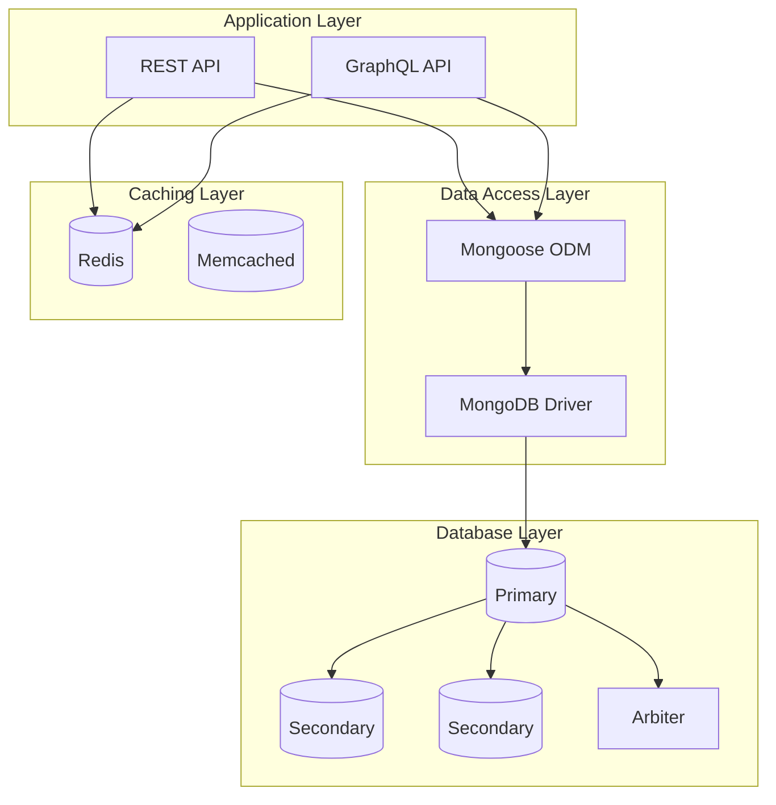

# Database Design Guide

## 🗄️ Overview

This guide covers database design principles for modern web applications using MongoDB as the primary database. Learn how to design efficient, scalable database schemas with AI-assisted development techniques.

## 🏗️ Database Architecture

### NoSQL vs SQL Considerations

#### When to Choose MongoDB (Our Choice)
- **Flexible Schema**: Easy to evolve data structures
- **Document-Based**: Natural fit for JSON APIs
- **Horizontal Scaling**: Built-in sharding support
- **Rich Queries**: Powerful aggregation framework
- **Developer Experience**: Works well with JavaScript/Node.js

#### MongoDB Architecture Patterns



## 📊 Schema Design Principles

### Document Structure Design

#### 1. Embed vs Reference Decision Tree

```javascript
// EMBED when:
// - Data is accessed together frequently
// - Child documents don't exceed 16MB limit
// - Child documents don't need independent access
// - Relationship is 1:1 or 1:few

// User with embedded address (1:1 relationship)
const userSchema = {
  name: "John Doe",
  email: "john@example.com",
  address: {
    street: "123 Main St",
    city: "New York",
    zipCode: "10001",
    country: "USA"
  },
  preferences: {
    theme: "dark",
    notifications: {
      email: true,
      push: false,
      sms: true
    }
  }
};

// REFERENCE when:
// - Documents are large and accessed independently
// - Many-to-many relationships
// - Need to query child documents independently
// - Child documents are shared across parents

// Order referencing products (many-to-many)
const orderSchema = {
  _id: ObjectId("..."),
  orderNumber: "ORD-2024-001",
  customer: ObjectId("customer_id"),
  items: [
    {
      product: ObjectId("product_id_1"), // Reference
      quantity: 2,
      price: 99.99
    },
    {
      product: ObjectId("product_id_2"), // Reference
      quantity: 1,
      price: 149.99
    }
  ],
  status: "pending",
  createdAt: new Date()
};
```

#### 2. Schema Evolution Strategies

```javascript
// Version-based schema evolution
const productSchemaV1 = {
  _id: ObjectId("..."),
  name: "Laptop",
  price: 999.99,
  description: "High-performance laptop",
  schemaVersion: 1
};

const productSchemaV2 = {
  _id: ObjectId("..."),
  name: "Laptop",
  pricing: {  // Evolved from simple price
    base: 999.99,
    currency: "USD",
    discounts: []
  },
  description: "High-performance laptop",
  specifications: {  // New field
    cpu: "Intel i7",
    memory: "16GB",
    storage: "512GB SSD"
  },
  schemaVersion: 2
};

// Migration function
const migrateProductSchema = async (product) => {
  if (product.schemaVersion === 1) {
    const updated = {
      ...product,
      pricing: {
        base: product.price,
        currency: "USD",
        discounts: []
      },
      specifications: {},
      schemaVersion: 2
    };
    delete updated.price;
    return updated;
  }
  return product;
};
```

## 🛠️ Mongoose Schema Implementation

### User Management Schema

```javascript
// models/User.js
import mongoose from 'mongoose';
import bcrypt from 'bcrypt';
import validator from 'validator';

const addressSchema = new mongoose.Schema({
  type: {
    type: String,
    enum: ['billing', 'shipping', 'both'],
    default: 'both'
  },
  street: {
    type: String,
    required: true,
    trim: true,
    maxlength: 100
  },
  city: {
    type: String,
    required: true,
    trim: true,
    maxlength: 50
  },
  state: {
    type: String,
    trim: true,
    maxlength: 50
  },
  zipCode: {
    type: String,
    required: true,
    trim: true,
    validate: {
      validator: function(v) {
        return /^\d{5}(-\d{4})?$/.test(v);
      },
      message: 'Invalid ZIP code format'
    }
  },
  country: {
    type: String,
    required: true,
    trim: true,
    maxlength: 50,
    default: 'USA'
  },
  isDefault: {
    type: Boolean,
    default: false
  }
}, { _id: false });

const userSchema = new mongoose.Schema({
  name: {
    type: String,
    required: [true, 'Name is required'],
    trim: true,
    minlength: [2, 'Name must be at least 2 characters'],
    maxlength: [50, 'Name cannot exceed 50 characters']
  },
  email: {
    type: String,
    required: [true, 'Email is required'],
    unique: true,
    lowercase: true,
    trim: true,
    validate: [validator.isEmail, 'Invalid email format']
  },
  password: {
    type: String,
    required: [true, 'Password is required'],
    minlength: [8, 'Password must be at least 8 characters'],
    select: false // Don't include in queries by default
  },
  role: {
    type: String,
    enum: ['customer', 'admin', 'moderator'],
    default: 'customer'
  },
  profile: {
    avatar: {
      type: String,
      validate: [validator.isURL, 'Invalid avatar URL']
    },
    bio: {
      type: String,
      maxlength: [500, 'Bio cannot exceed 500 characters']
    },
    dateOfBirth: {
      type: Date,
      validate: {
        validator: function(v) {
          return v < new Date();
        },
        message: 'Date of birth must be in the past'
      }
    },
    phone: {
      type: String,
      validate: {
        validator: function(v) {
          return !v || /^\+?[\d\s\-\(\)]{10,}$/.test(v);
        },
        message: 'Invalid phone number format'
      }
    }
  },
  addresses: [addressSchema],
  preferences: {
    newsletter: {
      type: Boolean,
      default: true
    },
    notifications: {
      email: { type: Boolean, default: true },
      push: { type: Boolean, default: true },
      sms: { type: Boolean, default: false }
    },
    theme: {
      type: String,
      enum: ['light', 'dark', 'auto'],
      default: 'auto'
    }
  },
  status: {
    type: String,
    enum: ['active', 'inactive', 'suspended'],
    default: 'active'
  },
  emailVerified: {
    type: Boolean,
    default: false
  },
  emailVerificationToken: String,
  passwordResetToken: String,
  passwordResetExpires: Date,
  lastLoginAt: Date,
  loginAttempts: {
    type: Number,
    default: 0
  },
  lockUntil: Date
}, {
  timestamps: true,
  toJSON: { 
    virtuals: true,
    transform: function(doc, ret) {
      delete ret.password;
      delete ret.emailVerificationToken;
      delete ret.passwordResetToken;
      delete ret.__v;
      return ret;
    }
  }
});

// Indexes
userSchema.index({ email: 1 });
userSchema.index({ 'profile.phone': 1 });
userSchema.index({ status: 1, emailVerified: 1 });
userSchema.index({ createdAt: -1 });

// Virtual for account lock status
userSchema.virtual('isLocked').get(function() {
  return !!(this.lockUntil && this.lockUntil > Date.now());
});

// Pre-save middleware for password hashing
userSchema.pre('save', async function(next) {
  if (!this.isModified('password')) return next();
  
  this.password = await bcrypt.hash(this.password, 12);
  next();
});

// Pre-save middleware for default address
userSchema.pre('save', function(next) {
  if (this.addresses.length === 1) {
    this.addresses[0].isDefault = true;
  } else if (this.addresses.length > 1) {
    const defaultCount = this.addresses.filter(addr => addr.isDefault).length;
    if (defaultCount === 0) {
      this.addresses[0].isDefault = true;
    } else if (defaultCount > 1) {
      // Keep only the first default address
      let foundDefault = false;
      this.addresses.forEach(addr => {
        if (addr.isDefault && !foundDefault) {
          foundDefault = true;
        } else {
          addr.isDefault = false;
        }
      });
    }
  }
  next();
});

// Instance methods
userSchema.methods.comparePassword = async function(candidatePassword) {
  return bcrypt.compare(candidatePassword, this.password);
};

userSchema.methods.incrementLoginAttempts = function() {
  // If we have a previous lock that has expired, restart at 1
  if (this.lockUntil && this.lockUntil < Date.now()) {
    return this.updateOne({
      $unset: { lockUntil: 1 },
      $set: { loginAttempts: 1 }
    });
  }
  
  const updates = { $inc: { loginAttempts: 1 } };
  
  // Lock account after 5 attempts for 2 hours
  if (this.loginAttempts + 1 >= 5 && !this.isLocked) {
    updates.$set = { lockUntil: Date.now() + 2 * 60 * 60 * 1000 };
  }
  
  return this.updateOne(updates);
};

userSchema.methods.resetLoginAttempts = function() {
  return this.updateOne({
    $unset: { loginAttempts: 1, lockUntil: 1 }
  });
};

export const User = mongoose.model('User', userSchema);
```

### Product Catalog Schema

```javascript
// models/Product.js
import mongoose from 'mongoose';

const specificationSchema = new mongoose.Schema({
  name: {
    type: String,
    required: true,
    trim: true
  },
  value: {
    type: String,
    required: true,
    trim: true
  },
  unit: {
    type: String,
    trim: true
  }
}, { _id: false });

const variantSchema = new mongoose.Schema({
  name: {
    type: String,
    required: true,
    trim: true
  },
  sku: {
    type: String,
    required: true,
    unique: true,
    trim: true
  },
  price: {
    type: Number,
    required: true,
    min: 0
  },
  inventory: {
    quantity: { type: Number, default: 0, min: 0 },
    reserved: { type: Number, default: 0, min: 0 },
    lowStockThreshold: { type: Number, default: 10, min: 0 }
  },
  attributes: {
    color: String,
    size: String,
    material: String
  },
  images: [{
    url: {
      type: String,
      required: true,
      validate: {
        validator: function(v) {
          return /^https?:\/\/.+\.(jpg|jpeg|png|webp)$/i.test(v);
        },
        message: 'Invalid image URL format'
      }
    },
    alt: String,
    isPrimary: { type: Boolean, default: false }
  }],
  isActive: {
    type: Boolean,
    default: true
  }
});

const productSchema = new mongoose.Schema({
  name: {
    type: String,
    required: [true, 'Product name is required'],
    trim: true,
    minlength: [3, 'Product name must be at least 3 characters'],
    maxlength: [100, 'Product name cannot exceed 100 characters']
  },
  slug: {
    type: String,
    required: true,
    unique: true,
    lowercase: true,
    trim: true
  },
  description: {
    short: {
      type: String,
      required: [true, 'Short description is required'],
      maxlength: [200, 'Short description cannot exceed 200 characters']
    },
    full: {
      type: String,
      required: [true, 'Full description is required'],
      maxlength: [2000, 'Full description cannot exceed 2000 characters']
    }
  },
  category: {
    type: mongoose.Schema.Types.ObjectId,
    ref: 'Category',
    required: [true, 'Category is required']
  },
  brand: {
    type: String,
    trim: true,
    maxlength: [50, 'Brand name cannot exceed 50 characters']
  },
  specifications: [specificationSchema],
  variants: [variantSchema],
  basePrice: {
    type: Number,
    required: true,
    min: [0, 'Price cannot be negative']
  },
  pricing: {
    cost: { type: Number, min: 0 },
    msrp: { type: Number, min: 0 },
    salePrice: { type: Number, min: 0 },
    saleStartDate: Date,
    saleEndDate: Date
  },
  seo: {
    metaTitle: {
      type: String,
      maxlength: [60, 'Meta title cannot exceed 60 characters']
    },
    metaDescription: {
      type: String,
      maxlength: [160, 'Meta description cannot exceed 160 characters']
    },
    keywords: [{
      type: String,
      trim: true,
      lowercase: true
    }]
  },
  ratings: {
    average: {
      type: Number,
      default: 0,
      min: 0,
      max: 5
    },
    count: {
      type: Number,
      default: 0,
      min: 0
    },
    distribution: {
      1: { type: Number, default: 0 },
      2: { type: Number, default: 0 },
      3: { type: Number, default: 0 },
      4: { type: Number, default: 0 },
      5: { type: Number, default: 0 }
    }
  },
  tags: [{
    type: String,
    trim: true,
    lowercase: true
  }],
  status: {
    type: String,
    enum: ['draft', 'active', 'discontinued', 'out-of-stock'],
    default: 'draft'
  },
  featured: {
    type: Boolean,
    default: false
  },
  weight: {
    value: { type: Number, min: 0 },
    unit: { type: String, enum: ['g', 'kg', 'lb', 'oz'], default: 'kg' }
  },
  dimensions: {
    length: { type: Number, min: 0 },
    width: { type: Number, min: 0 },
    height: { type: Number, min: 0 },
    unit: { type: String, enum: ['cm', 'in'], default: 'cm' }
  }
}, {
  timestamps: true,
  toJSON: { virtuals: true }
});

// Indexes for performance
productSchema.index({ name: 'text', 'description.short': 'text', 'description.full': 'text' });
productSchema.index({ category: 1, status: 1 });
productSchema.index({ 'ratings.average': -1 });
productSchema.index({ basePrice: 1 });
productSchema.index({ tags: 1 });
productSchema.index({ featured: 1, status: 1 });
productSchema.index({ slug: 1 });
productSchema.index({ createdAt: -1 });

// Compound indexes
productSchema.index({ category: 1, basePrice: 1, 'ratings.average': -1 });
productSchema.index({ status: 1, featured: 1, createdAt: -1 });

// Virtual for current price (considering sales)
productSchema.virtual('currentPrice').get(function() {
  const now = new Date();
  if (this.pricing.salePrice && 
      this.pricing.saleStartDate <= now && 
      this.pricing.saleEndDate >= now) {
    return this.pricing.salePrice;
  }
  return this.basePrice;
});

// Virtual for availability
productSchema.virtual('isAvailable').get(function() {
  if (this.status !== 'active') return false;
  if (this.variants.length > 0) {
    return this.variants.some(variant => 
      variant.isActive && variant.inventory.quantity > variant.inventory.reserved
    );
  }
  return true;
});

// Pre-save middleware for slug generation
productSchema.pre('save', function(next) {
  if (this.isModified('name') && !this.slug) {
    this.slug = this.name
      .toLowerCase()
      .replace(/[^a-z0-9 -]/g, '')
      .replace(/\s+/g, '-')
      .replace(/-+/g, '-');
  }
  next();
});

// Pre-save middleware for variant primary image
productSchema.pre('save', function(next) {
  this.variants.forEach(variant => {
    const primaryImages = variant.images.filter(img => img.isPrimary);
    if (primaryImages.length === 0 && variant.images.length > 0) {
      variant.images[0].isPrimary = true;
    } else if (primaryImages.length > 1) {
      // Keep only the first primary image
      let foundPrimary = false;
      variant.images.forEach(img => {
        if (img.isPrimary && !foundPrimary) {
          foundPrimary = true;
        } else {
          img.isPrimary = false;
        }
      });
    }
  });
  next();
});

export const Product = mongoose.model('Product', productSchema);
```

### Order Management Schema

```javascript
// models/Order.js
import mongoose from 'mongoose';

const orderItemSchema = new mongoose.Schema({
  product: {
    type: mongoose.Schema.Types.ObjectId,
    ref: 'Product',
    required: true
  },
  variant: {
    type: mongoose.Schema.Types.ObjectId,
    required: false
  },
  name: {
    type: String,
    required: true
  },
  sku: String,
  quantity: {
    type: Number,
    required: true,
    min: [1, 'Quantity must be at least 1']
  },
  price: {
    type: Number,
    required: true,
    min: [0, 'Price cannot be negative']
  },
  total: {
    type: Number,
    required: true,
    min: [0, 'Total cannot be negative']
  }
}, { _id: false });

const addressSchema = new mongoose.Schema({
  street: { type: String, required: true },
  city: { type: String, required: true },
  state: String,
  zipCode: { type: String, required: true },
  country: { type: String, required: true, default: 'USA' }
}, { _id: false });

const orderSchema = new mongoose.Schema({
  orderNumber: {
    type: String,
    required: true,
    unique: true
  },
  customer: {
    type: mongoose.Schema.Types.ObjectId,
    ref: 'User',
    required: true
  },
  items: [orderItemSchema],
  subtotal: {
    type: Number,
    required: true,
    min: 0
  },
  tax: {
    type: Number,
    required: true,
    min: 0
  },
  shipping: {
    cost: { type: Number, required: true, min: 0 },
    method: { type: String, required: true },
    carrier: String,
    trackingNumber: String,
    estimatedDelivery: Date
  },
  discount: {
    code: String,
    amount: { type: Number, default: 0, min: 0 },
    type: { type: String, enum: ['fixed', 'percentage'], default: 'fixed' }
  },
  total: {
    type: Number,
    required: true,
    min: 0
  },
  currency: {
    type: String,
    required: true,
    default: 'USD',
    uppercase: true
  },
  status: {
    type: String,
    enum: ['pending', 'confirmed', 'processing', 'shipped', 'delivered', 'cancelled', 'refunded'],
    default: 'pending'
  },
  addresses: {
    billing: { type: addressSchema, required: true },
    shipping: { type: addressSchema, required: true }
  },
  payment: {
    method: {
      type: String,
      required: true,
      enum: ['credit_card', 'debit_card', 'paypal', 'stripe', 'cash_on_delivery']
    },
    status: {
      type: String,
      enum: ['pending', 'authorized', 'captured', 'failed', 'refunded'],
      default: 'pending'
    },
    transactionId: String,
    paidAt: Date
  },
  notes: {
    customer: String,
    internal: String
  },
  timeline: [{
    status: String,
    timestamp: { type: Date, default: Date.now },
    note: String,
    updatedBy: {
      type: mongoose.Schema.Types.ObjectId,
      ref: 'User'
    }
  }]
}, {
  timestamps: true,
  toJSON: { virtuals: true }
});

// Indexes
orderSchema.index({ orderNumber: 1 });
orderSchema.index({ customer: 1, createdAt: -1 });
orderSchema.index({ status: 1, createdAt: -1 });
orderSchema.index({ 'payment.status': 1 });
orderSchema.index({ createdAt: -1 });

// Pre-save middleware for order number generation
orderSchema.pre('save', async function(next) {
  if (this.isNew && !this.orderNumber) {
    const year = new Date().getFullYear();
    const month = String(new Date().getMonth() + 1).padStart(2, '0');
    const count = await this.constructor.countDocuments({
      createdAt: {
        $gte: new Date(year, new Date().getMonth(), 1),
        $lt: new Date(year, new Date().getMonth() + 1, 1)
      }
    });
    this.orderNumber = `ORD-${year}${month}-${String(count + 1).padStart(4, '0')}`;
  }
  next();
});

// Pre-save middleware for status timeline
orderSchema.pre('save', function(next) {
  if (this.isModified('status') && !this.isNew) {
    this.timeline.push({
      status: this.status,
      timestamp: new Date()
    });
  }
  next();
});

export const Order = mongoose.model('Order', orderSchema);
```

## 🚀 Query Optimization

### Efficient Query Patterns

```javascript
// Service layer with optimized queries
export class ProductService {
  // Optimized product listing with aggregation
  async getProductsOptimized(filters = {}, options = {}) {
    const {
      page = 1,
      limit = 20,
      sort = { createdAt: -1 },
      includeVariants = false
    } = options;

    const pipeline = [
      // Match stage - use indexes
      { $match: filters },
      
      // Lookup category information
      {
        $lookup: {
          from: 'categories',
          localField: 'category',
          foreignField: '_id',
          as: 'categoryInfo'
        }
      },
      
      // Add computed fields
      {
        $addFields: {
          category: { $arrayElemAt: ['$categoryInfo', 0] },
          isOnSale: {
            $and: [
              { $ne: ['$pricing.salePrice', null] },
              { $lte: ['$pricing.saleStartDate', new Date()] },
              { $gte: ['$pricing.saleEndDate', new Date()] }
            ]
          },
          currentPrice: {
            $cond: {
              if: {
                $and: [
                  { $ne: ['$pricing.salePrice', null] },
                  { $lte: ['$pricing.saleStartDate', new Date()] },
                  { $gte: ['$pricing.saleEndDate', new Date()] }
                ]
              },
              then: '$pricing.salePrice',
              else: '$basePrice'
            }
          }
        }
      },
      
      // Project only needed fields
      {
        $project: {
          name: 1,
          slug: 1,
          'description.short': 1,
          'category.name': 1,
          'category.slug': 1,
          brand: 1,
          basePrice: 1,
          currentPrice: 1,
          isOnSale: 1,
          'ratings.average': 1,
          'ratings.count': 1,
          status: 1,
          featured: 1,
          tags: 1,
          // Include variants only if requested
          ...(includeVariants && { variants: 1 })
        }
      },
      
      // Sort
      { $sort: sort },
      
      // Facet for pagination and total count
      {
        $facet: {
          data: [
            { $skip: (page - 1) * limit },
            { $limit: limit }
          ],
          totalCount: [
            { $count: 'count' }
          ]
        }
      }
    ];

    const [result] = await Product.aggregate(pipeline);
    const products = result.data;
    const total = result.totalCount[0]?.count || 0;

    return {
      products,
      pagination: {
        page,
        limit,
        total,
        pages: Math.ceil(total / limit)
      }
    };
  }

  // Optimized search with text indexes
  async searchProducts(searchTerm, filters = {}, options = {}) {
    const searchFilters = {
      ...filters,
      $text: { $search: searchTerm }
    };

    return this.getProductsOptimized(searchFilters, {
      ...options,
      sort: { score: { $meta: 'textScore' }, ...options.sort }
    });
  }

  // Bulk operations for better performance
  async updateProductRatings(productUpdates) {
    const bulkOps = productUpdates.map(update => ({
      updateOne: {
        filter: { _id: update.productId },
        update: {
          $set: {
            'ratings.average': update.averageRating,
            'ratings.count': update.totalReviews,
            'ratings.distribution': update.distribution
          }
        }
      }
    }));

    return Product.bulkWrite(bulkOps);
  }
}
```

### Index Strategy

```javascript
// Advanced indexing for optimal performance
export const createIndexes = async () => {
  const db = mongoose.connection.db;
  
  // Users collection indexes
  await db.collection('users').createIndexes([
    { key: { email: 1 }, unique: true },
    { key: { status: 1, emailVerified: 1 } },
    { key: { role: 1 } },
    { key: { createdAt: -1 } },
    { key: { lastLoginAt: -1 } }
  ]);

  // Products collection indexes
  await db.collection('products').createIndexes([
    // Text search index
    { 
      key: { 
        name: 'text', 
        'description.short': 'text', 
        'description.full': 'text',
        tags: 'text'
      },
      name: 'product_text_search'
    },
    
    // Compound indexes for filtering
    { key: { category: 1, status: 1, featured: 1 } },
    { key: { status: 1, basePrice: 1 } },
    { key: { category: 1, 'ratings.average': -1 } },
    { key: { featured: 1, createdAt: -1 } },
    
    // Single field indexes
    { key: { slug: 1 }, unique: true },
    { key: { 'ratings.average': -1 } },
    { key: { basePrice: 1 } },
    { key: { createdAt: -1 } }
  ]);

  // Orders collection indexes
  await db.collection('orders').createIndexes([
    { key: { orderNumber: 1 }, unique: true },
    { key: { customer: 1, createdAt: -1 } },
    { key: { status: 1, createdAt: -1 } },
    { key: { 'payment.status': 1 } },
    { key: { createdAt: -1 } }
  ]);

  // Categories collection indexes
  await db.collection('categories').createIndexes([
    { key: { slug: 1 }, unique: true },
    { key: { parent: 1 } },
    { key: { level: 1, order: 1 } }
  ]);

  console.log('Database indexes created successfully');
};
```

## 🔍 Performance Monitoring

### Query Performance Analysis

```javascript
// Query performance monitoring middleware
export const queryProfiler = {
  async profile(query, collection) {
    const start = Date.now();
    
    try {
      const result = await query;
      const duration = Date.now() - start;
      
      // Log slow queries (> 100ms)
      if (duration > 100) {
        console.warn(`Slow query detected:`, {
          collection,
          duration: `${duration}ms`,
          query: query.getQuery ? query.getQuery() : 'Unknown'
        });
      }
      
      return result;
    } catch (error) {
      const duration = Date.now() - start;
      console.error(`Query failed after ${duration}ms:`, error);
      throw error;
    }
  },

  // Explain query execution
  async explainQuery(model, query) {
    const explanation = await model.find(query).explain('executionStats');
    
    console.log('Query Execution Stats:', {
      executionTimeMillis: explanation.executionStats.executionTimeMillis,
      totalDocsExamined: explanation.executionStats.totalDocsExamined,
      totalDocsReturned: explanation.executionStats.totalDocsReturned,
      indexesUsed: explanation.executionStats.executionStages?.indexName || 'None'
    });
    
    return explanation;
  }
};

// Usage in service methods
export class OptimizedProductService {
  async getProducts(filters, options) {
    const query = Product.find(filters)
      .populate('category', 'name slug')
      .sort(options.sort)
      .limit(options.limit)
      .skip((options.page - 1) * options.limit);
    
    return queryProfiler.profile(query, 'products');
  }
}
```

### Database Health Monitoring

```javascript
// Database health check utilities
export const dbHealthCheck = {
  async checkConnectionHealth() {
    const status = {
      connected: mongoose.connection.readyState === 1,
      host: mongoose.connection.host,
      name: mongoose.connection.name,
      collections: []
    };

    if (status.connected) {
      const collections = await mongoose.connection.db.listCollections().toArray();
      status.collections = collections.map(col => col.name);
      
      // Check index status
      for (const collection of status.collections) {
        const indexes = await mongoose.connection.db.collection(collection).listIndexes().toArray();
        console.log(`${collection} indexes:`, indexes.map(idx => idx.name));
      }
    }

    return status;
  },

  async getPerformanceStats() {
    if (mongoose.connection.readyState !== 1) return null;

    const stats = await mongoose.connection.db.stats();
    return {
      collections: stats.collections,
      documents: stats.objects,
      avgObjSize: stats.avgObjSize,
      dataSize: stats.dataSize,
      storageSize: stats.storageSize,
      indexes: stats.indexes,
      indexSize: stats.indexSize
    };
  }
};
```

---

**Next Steps**: Apply these database design patterns in your application and monitor query performance regularly.