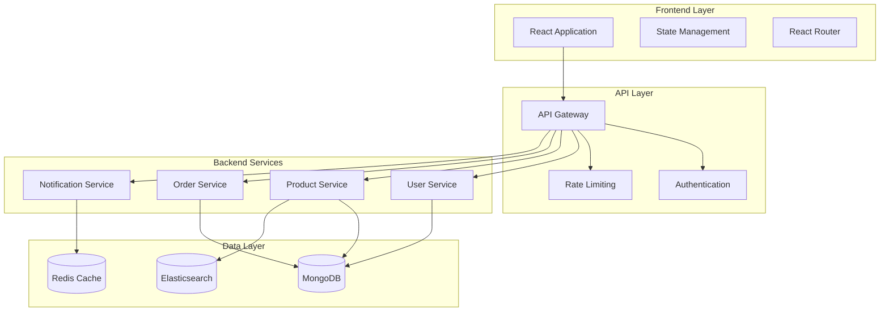

# Web Development Guide

## 🌐 Overview

This guide provides comprehensive information about modern web development practices, focusing on building scalable, maintainable, and secure web applications using AI-assisted development techniques.

## 🏗️ Architecture Patterns

### Modern Web Application Architecture



### Key Architectural Principles

1. **Separation of Concerns**
   - Frontend handles UI/UX
   - Backend manages business logic
   - Database handles data persistence

2. **API-First Design**
   - Design APIs before implementation
   - Use OpenAPI specifications
   - Version your APIs properly

3. **Microservices Architecture**
   - Loosely coupled services
   - Independent deployment
   - Service-specific databases

## 🛠️ Technology Stack

### Frontend Technologies

#### React Ecosystem
```javascript
// Modern React with Hooks and Context
import React, { useState, useContext, useEffect } from 'react';
import { BrowserRouter, Routes, Route } from 'react-router-dom';

// Component Example with TypeScript
interface ProductProps {
  id: string;
  name: string;
  price: number;
}

const ProductCard: React.FC<ProductProps> = ({ id, name, price }) => {
  const [isLoading, setIsLoading] = useState(false);
  
  return (
    <div className="product-card">
      <h3>{name}</h3>
      <p>${price.toFixed(2)}</p>
    </div>
  );
};
```

#### State Management Options
- **Redux Toolkit**: For complex state management
- **Zustand**: Lightweight alternative
- **React Context**: For simple state sharing
- **SWR/React Query**: For server state management

### Backend Technologies

#### Node.js with Express
```javascript
// Modern Express.js API with TypeScript
import express from 'express';
import { body, validationResult } from 'express-validator';
import jwt from 'jsonwebtoken';

const app = express();

// Middleware
app.use(express.json());
app.use(express.urlencoded({ extended: true }));

// Route with validation
app.post('/api/products', 
  body('name').isLength({ min: 3 }).withMessage('Name must be at least 3 characters'),
  body('price').isNumeric().withMessage('Price must be a number'),
  async (req, res) => {
    const errors = validationResult(req);
    if (!errors.isEmpty()) {
      return res.status(400).json({ errors: errors.array() });
    }
    
    // Business logic here
    res.json({ message: 'Product created successfully' });
  }
);
```

### Database Technologies

#### MongoDB with Mongoose
```javascript
// Mongoose Schema Example
import mongoose from 'mongoose';

const productSchema = new mongoose.Schema({
  name: {
    type: String,
    required: true,
    trim: true,
    minlength: 3,
    maxlength: 100
  },
  description: {
    type: String,
    required: true,
    maxlength: 500
  },
  price: {
    type: Number,
    required: true,
    min: 0
  },
  category: {
    type: mongoose.Schema.Types.ObjectId,
    ref: 'Category',
    required: true
  },
  images: [{
    url: String,
    alt: String
  }],
  inventory: {
    quantity: { type: Number, default: 0 },
    reserved: { type: Number, default: 0 }
  },
  ratings: {
    average: { type: Number, default: 0 },
    count: { type: Number, default: 0 }
  }
}, {
  timestamps: true
});

// Indexes for performance
productSchema.index({ name: 'text', description: 'text' });
productSchema.index({ category: 1, price: 1 });
productSchema.index({ 'ratings.average': -1 });

export const Product = mongoose.model('Product', productSchema);
```

## 🔒 Security Best Practices

### Authentication and Authorization

#### JWT Implementation
```javascript
// JWT Authentication Middleware
import jwt from 'jsonwebtoken';

export const authenticateToken = (req, res, next) => {
  const authHeader = req.headers['authorization'];
  const token = authHeader && authHeader.split(' ')[1];

  if (!token) {
    return res.status(401).json({ error: 'Access token required' });
  }

  jwt.verify(token, process.env.JWT_SECRET, (err, user) => {
    if (err) {
      return res.status(403).json({ error: 'Invalid token' });
    }
    req.user = user;
    next();
  });
};

// Role-based authorization
export const authorize = (roles) => {
  return (req, res, next) => {
    if (!req.user || !roles.includes(req.user.role)) {
      return res.status(403).json({ error: 'Insufficient permissions' });
    }
    next();
  };
};
```

### Input Validation and Sanitization

#### Data Validation with Joi
```javascript
import Joi from 'joi';

// Product validation schema
export const productValidationSchema = Joi.object({
  name: Joi.string().min(3).max(100).required(),
  description: Joi.string().max(500).required(),
  price: Joi.number().positive().required(),
  categoryId: Joi.string().hex().length(24).required(),
  images: Joi.array().items(
    Joi.object({
      url: Joi.string().uri().required(),
      alt: Joi.string().max(100)
    })
  ).max(5)
});

// Validation middleware
export const validateProduct = (req, res, next) => {
  const { error } = productValidationSchema.validate(req.body);
  if (error) {
    return res.status(400).json({
      error: 'Validation failed',
      details: error.details.map(detail => detail.message)
    });
  }
  next();
};
```

### Security Headers and CORS

```javascript
import helmet from 'helmet';
import cors from 'cors';

// Security middleware
app.use(helmet({
  contentSecurityPolicy: {
    directives: {
      defaultSrc: ["'self'"],
      styleSrc: ["'self'", "'unsafe-inline'"],
      scriptSrc: ["'self'"],
      imgSrc: ["'self'", "data:", "https:"],
    },
  },
}));

// CORS configuration
app.use(cors({
  origin: process.env.FRONTEND_URL,
  credentials: true,
  optionsSuccessStatus: 200
}));
```

## 🚀 Performance Optimization

### Frontend Performance

#### Code Splitting and Lazy Loading
```javascript
import React, { Suspense, lazy } from 'react';

// Lazy load components
const ProductCatalog = lazy(() => import('./components/ProductCatalog'));
const UserDashboard = lazy(() => import('./components/UserDashboard'));

function App() {
  return (
    <div className="App">
      <Suspense fallback={<div>Loading...</div>}>
        <Routes>
          <Route path="/products" element={<ProductCatalog />} />
          <Route path="/dashboard" element={<UserDashboard />} />
        </Routes>
      </Suspense>
    </div>
  );
}
```

#### Memoization and Optimization
```javascript
import React, { memo, useMemo, useCallback } from 'react';

const ProductList = memo(({ products, onProductClick }) => {
  // Memoize expensive calculations
  const sortedProducts = useMemo(() => {
    return products.sort((a, b) => b.rating - a.rating);
  }, [products]);

  // Memoize event handlers
  const handleProductClick = useCallback((productId) => {
    onProductClick(productId);
  }, [onProductClick]);

  return (
    <div>
      {sortedProducts.map(product => (
        <ProductCard 
          key={product.id}
          product={product}
          onClick={handleProductClick}
        />
      ))}
    </div>
  );
});
```

### Backend Performance

#### Database Query Optimization
```javascript
// Efficient MongoDB queries
class ProductService {
  // Use indexes and projections
  async getProducts(filters, page = 1, limit = 20) {
    const skip = (page - 1) * limit;
    
    const query = Product.find(filters)
      .select('name price images.url ratings.average') // Only needed fields
      .populate('category', 'name') // Populate only needed fields
      .sort({ 'ratings.average': -1 })
      .skip(skip)
      .limit(limit)
      .lean(); // Return plain objects for better performance
    
    return query;
  }

  // Aggregation for complex queries
  async getProductStats() {
    return Product.aggregate([
      {
        $group: {
          _id: '$category',
          count: { $sum: 1 },
          avgPrice: { $avg: '$price' },
          avgRating: { $avg: '$ratings.average' }
        }
      },
      {
        $lookup: {
          from: 'categories',
          localField: '_id',
          foreignField: '_id',
          as: 'categoryInfo'
        }
      }
    ]);
  }
}
```

#### Caching Strategies
```javascript
import Redis from 'ioredis';

const redis = new Redis(process.env.REDIS_URL);

// Cache middleware
export const cache = (duration = 300) => {
  return async (req, res, next) => {
    const key = `cache:${req.originalUrl}`;
    
    try {
      const cached = await redis.get(key);
      if (cached) {
        return res.json(JSON.parse(cached));
      }
      
      // Store original res.json
      const originalJson = res.json;
      res.json = function(data) {
        // Cache the response
        redis.setex(key, duration, JSON.stringify(data));
        originalJson.call(this, data);
      };
      
      next();
    } catch (error) {
      console.error('Cache error:', error);
      next();
    }
  };
};

// Usage
app.get('/api/products', cache(600), productController.getProducts);
```

## 🧪 Testing Strategies

### Frontend Testing

#### Unit Testing with Jest and React Testing Library
```javascript
import React from 'react';
import { render, screen, fireEvent, waitFor } from '@testing-library/react';
import { ProductCard } from './ProductCard';

describe('ProductCard', () => {
  const mockProduct = {
    id: '1',
    name: 'Test Product',
    price: 99.99,
    image: 'test-image.jpg'
  };

  it('renders product information correctly', () => {
    render(<ProductCard product={mockProduct} />);
    
    expect(screen.getByText('Test Product')).toBeInTheDocument();
    expect(screen.getByText('$99.99')).toBeInTheDocument();
  });

  it('calls onAddToCart when button is clicked', async () => {
    const mockAddToCart = jest.fn();
    render(<ProductCard product={mockProduct} onAddToCart={mockAddToCart} />);
    
    fireEvent.click(screen.getByText('Add to Cart'));
    
    await waitFor(() => {
      expect(mockAddToCart).toHaveBeenCalledWith(mockProduct.id);
    });
  });
});
```

### Backend Testing

#### API Testing with Supertest
```javascript
import request from 'supertest';
import app from '../app';
import { Product } from '../models/Product';

describe('Product API', () => {
  beforeEach(async () => {
    await Product.deleteMany({});
  });

  describe('POST /api/products', () => {
    it('should create a new product', async () => {
      const productData = {
        name: 'Test Product',
        description: 'A test product',
        price: 99.99,
        categoryId: '507f1f77bcf86cd799439011'
      };

      const response = await request(app)
        .post('/api/products')
        .send(productData)
        .expect(201);

      expect(response.body.name).toBe(productData.name);
      expect(response.body.price).toBe(productData.price);
    });

    it('should return validation error for invalid data', async () => {
      const invalidData = {
        name: 'AB', // Too short
        price: -10 // Negative price
      };

      const response = await request(app)
        .post('/api/products')
        .send(invalidData)
        .expect(400);

      expect(response.body.error).toBe('Validation failed');
    });
  });
});
```

## 📊 Monitoring and Analytics

### Application Monitoring

#### Custom Metrics Collection
```javascript
import prometheus from 'prom-client';

// Create custom metrics
const httpRequestDuration = new prometheus.Histogram({
  name: 'http_request_duration_seconds',
  help: 'Duration of HTTP requests in seconds',
  labelNames: ['method', 'route', 'status_code']
});

const activeUsers = new prometheus.Gauge({
  name: 'active_users_total',
  help: 'Number of active users'
});

// Middleware to collect metrics
export const metricsMiddleware = (req, res, next) => {
  const start = Date.now();
  const originalSend = res.send;

  res.send = function(data) {
    const duration = (Date.now() - start) / 1000;
    httpRequestDuration
      .labels(req.method, req.route?.path || req.path, res.statusCode)
      .observe(duration);
    
    originalSend.call(this, data);
  };

  next();
};

// Metrics endpoint
app.get('/metrics', async (req, res) => {
  res.set('Content-Type', prometheus.register.contentType);
  res.end(await prometheus.register.metrics());
});
```

### Error Tracking and Logging

```javascript
import winston from 'winston';

// Configure logger
const logger = winston.createLogger({
  level: 'info',
  format: winston.format.combine(
    winston.format.timestamp(),
    winston.format.errors({ stack: true }),
    winston.format.json()
  ),
  transports: [
    new winston.transports.File({ filename: 'error.log', level: 'error' }),
    new winston.transports.File({ filename: 'combined.log' })
  ]
});

// Error handling middleware
export const errorHandler = (error, req, res, next) => {
  logger.error({
    message: error.message,
    stack: error.stack,
    url: req.url,
    method: req.method,
    userId: req.user?.id
  });

  if (error.name === 'ValidationError') {
    return res.status(400).json({
      error: 'Validation failed',
      details: error.message
    });
  }

  if (error.name === 'UnauthorizedError') {
    return res.status(401).json({
      error: 'Authentication required'
    });
  }

  res.status(500).json({
    error: process.env.NODE_ENV === 'production' 
      ? 'Internal server error' 
      : error.message
  });
};
```

## 🔄 Development Workflow

### Git Workflow

#### Feature Branch Workflow
```bash
# Create feature branch
git checkout -b feature/product-reviews

# Make changes and commit
git add .
git commit -m "Add product review functionality"

# Push branch
git push origin feature/product-reviews

# Create pull request
# After review and approval, merge to main
```

### Code Quality Tools

#### ESLint Configuration
```javascript
// .eslintrc.js
module.exports = {
  extends: [
    'eslint:recommended',
    '@typescript-eslint/recommended',
    'prettier'
  ],
  parser: '@typescript-eslint/parser',
  plugins: ['@typescript-eslint', 'react-hooks'],
  rules: {
    'react-hooks/rules-of-hooks': 'error',
    'react-hooks/exhaustive-deps': 'warn',
    '@typescript-eslint/no-unused-vars': 'error',
    'prefer-const': 'error',
    'no-var': 'error'
  }
};
```

#### Prettier Configuration
```json
{
  "semi": true,
  "trailingComma": "es5",
  "singleQuote": true,
  "printWidth": 80,
  "tabWidth": 2
}
```

## 📚 Resources and Learning

### Essential Reading
- [React Documentation](https://reactjs.org/docs)
- [Node.js Best Practices](https://github.com/goldbergyoni/nodebestpractices)
- [MongoDB Manual](https://docs.mongodb.com/manual/)
- [Web Security Guidelines](https://owasp.org/www-project-top-ten/)

### Development Tools
- [VS Code](https://code.visualstudio.com/)
- [Postman](https://www.postman.com/) for API testing
- [MongoDB Compass](https://www.mongodb.com/products/compass) for database management
- [React Developer Tools](https://reactjs.org/blog/2019/08/15/new-react-devtools.html)

### Performance Tools
- [Lighthouse](https://developers.google.com/web/tools/lighthouse) for web performance
- [Bundle Analyzer](https://www.npmjs.com/package/webpack-bundle-analyzer) for bundle optimization
- [Chrome DevTools](https://developers.google.com/web/tools/chrome-devtools) for debugging

---

**Next Steps**: Apply these concepts in the [Sample Application](../sample-app/README.md) and complete the persona-specific exercises.