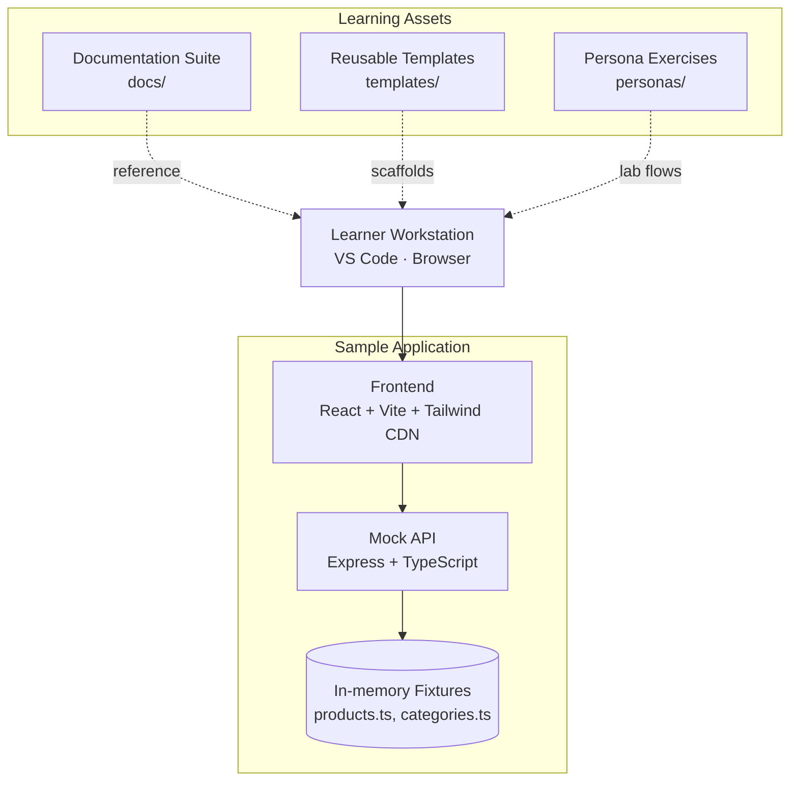
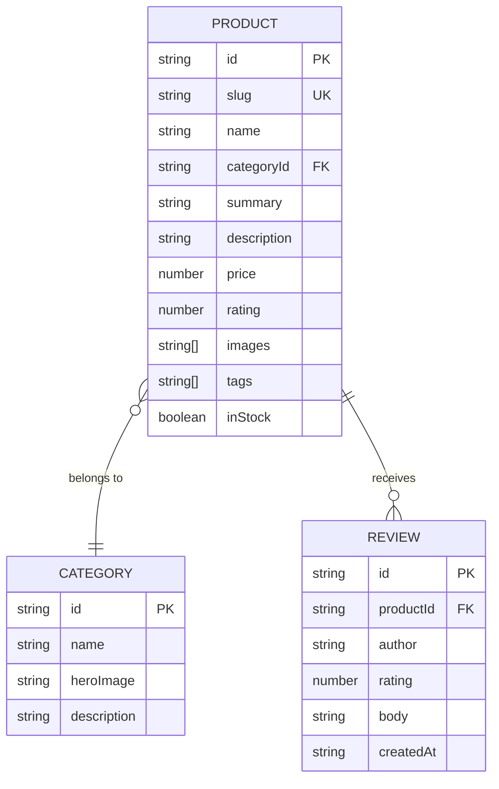
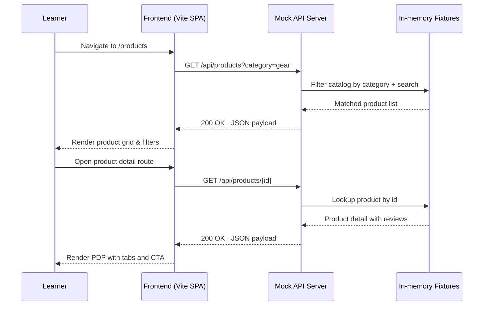
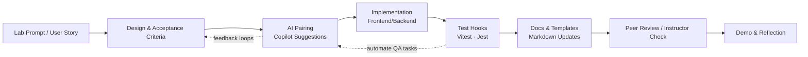

# ShopFlow Learning Platform — Architecture & Design

## Document Control

| Field | Value |
| --- | --- |
| Document ID | SD-APP-001 |
| Version | 2.0 |
| Status | Approved Draft |
| Maintainer | Architecture Guild |
| Last Updated | September 30, 2025 |

## 1. System Overview

### 1.1 Purpose

This document captures the current architecture and design of the ShopFlow Learning Platform. It serves as the single source of truth for instructors and learners who extend the sample application, deliver persona-driven labs, or integrate AI-assisted workflows.

### 1.2 Scope

- `sample-app/frontend`: React + Vite storefront used in learner exercises
- `sample-app/backend`: Express mock API exposing catalog data from in-memory fixtures
- `docs/`, `templates/`, `personas/`: Structured learning assets, templates, and persona-specific exercises
- Supporting npm scripts, TypeScript configuration, and testing scaffolds that tie the experience together

### 1.3 Glossary

| Term | Definition |
| --- | --- |
| Mock API | Lightweight Express server that returns deterministic, in-memory data |
| Legacy Blueprint | Archived `api-gateway/` folder demonstrating future-state architecture concepts |
| Persona Track | Role-specific exercise stream (BA, Developer, QA, DevOps, Documentation) |
| Fixture | Static JSON/TypeScript data structures shipped with the repository |

## 2. Architecture Summary

### 2.1 High-Level Landscape

### 2.2 Context & Boundaries

| Boundary | Description |
| --- | --- |
| Inside Scope | Frontend Vite project, mock backend, fixtures, persona exercises, documentation, npm tooling |
| Observed Interfaces | REST endpoints under `/api/products`, browser-rendered SPA routes, Markdown-based guides |
| Out of Scope | Persistent databases, production deployment infrastructure, authentication services |

## 3. Subsystem Deep Dive

### 3.1 Frontend (`sample-app/frontend`)

- **Tech Stack:** React 18, TypeScript, Vite, Tailwind via CDN
- **Key Entry Points:** `index.html` (loads Tailwind), `src/main.tsx` (bootstraps React), `src/App.tsx` (route composition)
- **State & Data:** Uses React Query-style patterns (to be implemented by learners) and fetches data from the mock API
- **Testing Hooks:** Vitest + Testing Library dependencies installed; actual suites authored during labs

### 3.2 Backend (`sample-app/backend`)

- **Runtime:** Node.js 18+, Express with TypeScript
- **Structure:**
  - `src/index.ts` — server bootstrap, health check, `/api/products` router wiring
  - `src/routes/products.ts` — query parsing, filtering, product lookup
  - `src/data/products.ts` — catalog fixture with categories, inventory, reviews, and metadata
- **Legacy Blueprint:** `api-gateway/` folder preserved for instructors to discuss API gateway and microservice evolution; not part of the running mock API

### 3.3 Learning Assets

- **Documentation (`docs/`)** — user guide, instructor delivery guide, persona-specific reference material
- **Persona Exercises (`personas/`)** — scoped challenges for Business Analyst, Developer, QA, DevOps, Documentation tracks
- **Templates (`templates/`)** — reusable requirement and testing templates to accelerate lab deliverables
- **System Guides** — `SYSTEM_DESIGN.md` (this document) and `SYSTEM_DESIGN.md` cross-referenced in persona material

### 3.4 Tooling

- **Package Management:** npm workspaces (implicit) with separate installs for frontend/back end
- **Type Checking:** TypeScript configs tailored per workspace
- **Linting & Formatting:** ESLint configs ready for extension; Prettier optional per team preference
- **AI Assistants:** GitHub Copilot recommended; instructions embedded in `docs/github-copilot-guide.md`

## 4. Data Design

### 4.1 Domain Model (Fixtures)

### 4.2 Data Flow

- Load fixtures at server startup to avoid disk reads per request
- Support query parameters: `category`, `search`, `limit`, `offset`
- Product detail endpoint resolves by `id` or `slug`
- Learners can extend the fixture model (e.g., add inventory counts, pricing tiers) and update this diagram accordingly

## 5. Operational Flows

### 5.1 Request/Response Lifecycle

### 5.2 Development Workflow

## 6. Quality, Testing, and Observability

### 6.1 Testing Strategy

| Layer | Present Capability | Lab Extension |
| --- | --- | --- |
| Frontend | Vitest + Testing Library deps installed | Learners author unit/component tests |
| Backend | Jest + Supertest configured in `package.json` | Create route validation & error-case coverage |
| End-to-End | Not provided out-of-the-box | Add Playwright/Cypress harness |

### 6.2 Quality Gates

- TypeScript compilation must pass (`npm run build` in each workspace)
- Linting optional but recommended (`eslint .` once configured)
- Instructor checklists ensure docs/templates updated after each exercise

### 6.3 Observability (Future-State)

- Mock API emits console logs only; learners can add Morgan custom streams
- Persona extensions propose structured logging, feature flags, or OpenTelemetry when introducing persistence layers

## 7. Infrastructure Considerations

### 7.1 Local Execution Environment

- Node.js 18+ and npm 9+ (see `sample-app/README.md`)
- Run front and back end concurrently for a complete experience
- Hot reload via Vite; Nodemon optional (not included) for backend labs

### 7.2 Evolution Path

- Legacy blueprint (`sample-app/backend/api-gateway/`) demonstrates how to grow towards a microservice topology, API gateway, and external integrations
- Suggested roadmap:
  1. Introduce persistent storage (PostgreSQL or MongoDB)
  2. Add auth service and JWT-based session management
  3. Containerise using Docker Compose; later migrate to Kubernetes for DevOps labs
  4. Implement CI/CD pipelines with GitHub Actions mirroring the flow in Section 5.2

## 8. AI Enablement

- AI pairing guidance documented in `docs/github-copilot-guide.md`
- Persona exercises prompt learners to compare manual vs AI-assisted outputs
- Recommended guardrails:
  - Keep AI-generated code under version control with review comments
  - Capture rationale in commit messages or lab journals
  - Record prompts that lead to architectural decisions for retrospectives

## 9. Security & Compliance Notes

- Mock API intentionally omits authentication; learners add guards when expanding the scope
- CORS configured for local development; document updates required when deploying beyond localhost
- No PII stored in fixtures; maintain fictional data sets aligned with training ethics

## 10. Appendix — Operational Commands

| Scenario | Commands |
| --- | --- |
| Install & run frontend | `cd sample-app/frontend` → `npm install` → `npm run dev` |
| Build frontend for validation | `npm run build` |
| Install & run backend | `cd sample-app/backend` → `npm install` → `npm run dev` |
| Build backend for type-check | `npm run build` |
| API smoke test | `curl http://localhost:4000/api/products` |

---

**Review Cadence:** Revisit this document every major lab iteration or when the architecture diverges materially from the mock implementation.
